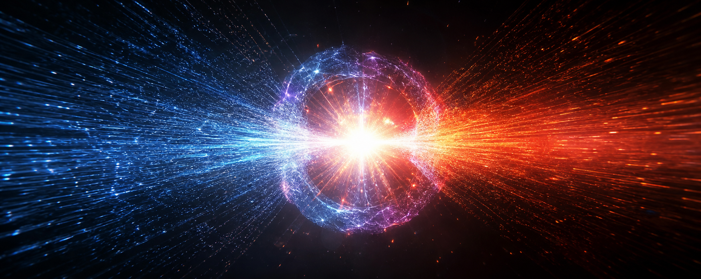
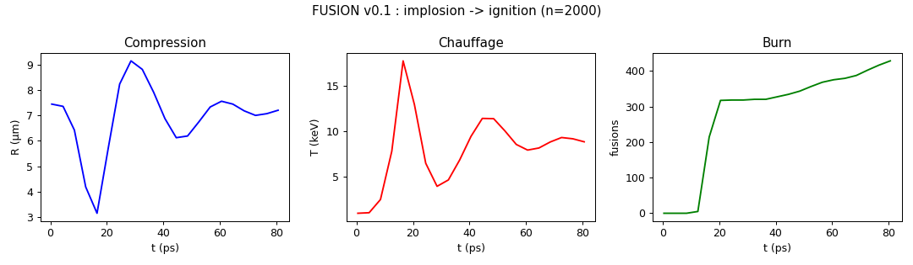
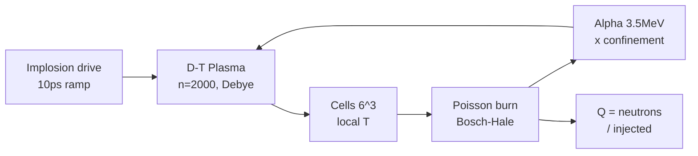

<p align="center"></p>

<h1 align="center">RATISS-FUSION</h1>
<p align="center"><i>D-T plasma pellet + ICF implosion + real Bosch-Hale reactivity — ignition <b>measured</b>.</i></p>
<p align="center"><b>NO NEURONS</b> — particles, Poisson, alpha, Q. ⚛️</p>

<p align="center">


</p>

<p align="center"></p>

> *"Did anyone ever understand a star better than by failing it five times before igniting it?"*
> — the chief. (5 physics bugs killed on the way, all documented. 😇)

---

## ⚡ In 30 seconds

| 🔥 | Step | Measured verdict |
|---|---|---|
| 1 | Compression | R 7.45 → **3.14 µm** (×2.4) |
| 2 | Heating + burn | T → **17.7 keV**, **428 fusions** |
| 3 | Gain | Q: 0 → peak **101** → **87** final |
| 4 | Rebound | the α pressure stops the implosion (topology!) |

**Status: IGNITION v0.1 VALIDATED.** Suite (v0.2 + stellar + engine): [RATISS-NUCLEAIRE](https://github.com/jonathansearch/RATISS-NUCLEAIRE).

---

## 🗺️ Table of contents

1. [The concept](#concept) — 2. [Quick start](#quickstart) — 3. [The lab's rooms](#salles) — 4. [The campaign](#campagne) — 5. [Key numbers](#chiffres) — 6. [Examples](#exemples) — 7. [The method](#methode) — 8. [Architecture](#archi) — 9. [Roadmap](#roadmap) — 10. [Tree](#arbo) — 11. [Credits](#credits)

---

<a id="concept"></a>
## 1. 💡 The concept

**The observation**: ICF (inertial confinement) gets simulated on supercomputers in weeks. Here, **2000 D-T macroparticles**, an implosion force, Debye-shielded Coulomb, and the **real Bosch-Hale 1992 reactivity** — and we measure compression, Poisson burn per cell, α heating and gain Q. The full physics movie: **compression → burn → rebound**.

**Radical honesty**: 5 bugs killed and documented (T units ×7e22!, superluminal α-kick, unshielded repulsion, unconfined α, instantaneous Q). Every bug found is one more seal.

---

<a id="quickstart"></a>
## 2. 🚀 Quick start

```bash
git clone https://github.com/jonathansearch/RATISS-FUSION.git
cd RATISS-FUSION
pip install -e .
pytest tests/ -q              # 4/4: Bosch-Hale, cold=0, implosion, burn
python3 demos/ignition.py     # run + Three.js scene -> demos/ignition_3d.html
```

Then open `demos/ignition_3d.html` in Chrome: D blue, T red, T + events live.

---

<a id="salles"></a>
## 3. 🏛️ The lab's rooms

| Room | Folder | Content |
|---|---|---|
| ⚛️ Engine | `fusion/` | Bosch-Hale, plasma, run |
| 🎬 Demos | `demos/` | ignition run + Three.js scene + figure |
| 🧪 Tests | `tests/` | 4 sealed (cold=0, hot=burn) |
| 🖼️ Gallery | `images/` | logo + ignition fresco |

---

<a id="campagne"></a>
## 4. 🧪 The v0.1 campaign (n=2000, 80 ps)

❓ Can a toy D-T pellet ignite? 🔧 drive 6e-10 N (10 ps ramp), Debye 0.1µm, w=1e7. 🏆 **R ×2.4, T 17.7 keV, 428 fusions, Q peak 101 → 87**. The cold case (0.3 keV, no drive) gives **0 events** — the control is perfect.



---

<a id="chiffres"></a>
## 5. 📊 Key numbers

| Measurement | Value | Control |
|---|---|---|
| Compression R | 7.45 → 3.14 µm (×2.4) | — |
| Peak T | 17.7 keV | cold: 0.3 keV |
| Fusions | 428 | cold: 0 events |
| Q | 0 → peak 101 → 87 | — |
| Bosch-Hale 10 keV | 1.1e-22 m³/s | literature ✓ |

---

<a id="exemples"></a>
## 6. 💻 Examples

**Ex. 1 — Standard run:**
```bash
python3 fusion/run.py
# [fusion] R=...µm T=...keV ev=... Q=...
```

**Ex. 2 — Verify Bosch-Hale yourself:**
```python
from fusion.bosch_hale import sigma_v
print(sigma_v(10.0))   # ~1.1e-22 m³/s (D-T, 10 keV)
```

---

<a id="methode"></a>
## 7. ⚖️ The method

**Declared vs measured.** Macro kinetics owned (1 event = w pairs — the toy ρR~1e-10 is 1e10 away from the NIF, documented, not hidden). **5 bugs killed** rather than hidden. The numbers are toy; the FILM (compression → burn → rebound) is the physics.

---

<a id="archi"></a>
## 8. 🗺️ Architecture



---

<a id="roadmap"></a>
## 9. 🗺️ Roadmap

1. ⚛️ **v0.2**: depletion + α transport + brem (done: see RATISS-NUCLEAIRE) ✅
2. 🌟 **Stellar**: collapse → supernova (done: see RATISS-NUCLEAIRE) ✅
3. 🔗 **Unified engine**: NAVIER compresses → FUSION burns (done: see RATISS-NUCLEAIRE) ✅

---

<a id="arbo"></a>
## 10. 📁 Tree

```
RATISS-FUSION/
├── README.md            # ← you are here
├── LICENSE              # MIT
├── pyproject.toml
├── fusion/              # bosch_hale.py, plasma.py, run.py
├── demos/               # ignition.py + Three.js scene + figure
├── tests/               # 4 sealed
└── images/              # logo + fresco
```

---

<a id="credits"></a>
## 11. 🖖 Credits

Designed and measured by **RATISS LABS**, Douala 🇨🇲 — free, reproducible, no neurons.

<p align="center"></p>

## 📜 License

MIT — see [LICENSE](LICENSE). Copyright (c) 2026 Jonathan.


## 🔗 Cross-repository dependencies

This repository uses: **RATISS-NAVIER (ignition demo)**. Clone them **side by side** in the same parent folder
(`git clone https://github.com/jonathansearch/<REPO>.git`), or point `RATISS_HOME` to that parent folder:

```bash
export RATISS_HOME=/path/to/the/folder/of/the/repos
pytest tests/ -q
```

No absolute path is hardcoded (portability fix of 09/30/2026).
