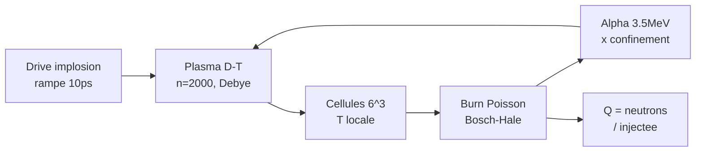

<p align="center"></p>

<h1 align="center">RATISS-FUSION</h1>
<p align="center"><i>Bille de plasma D-T + implosion ICF + réactivité Bosch-Hale réelle — l'ignition <b>mesurée</b>.</i></p>
<p align="center"><b>SANS NEURONES</b> — particules, Poisson, alpha, Q. ⚛️</p>

<p align="center">


</p>

<p align="center"></p>

> *« Comprit-on jamais mieux une étoile qu'en la ratant cinq fois avant de l'allumer ? »*
> — le chef. (5 bugs physiques tués en route, tous documentés. 😇)

---

## ⚡ En 30 secondes

| 🔥 | Étape | Verdict mesuré |
|---|---|---|
| 1 | Compression | R 7.45 → **3.14 µm** (×2.4) |
| 2 | Chauffage + burn | T → **17.7 keV**, **428 fusions** |
| 3 | Gain | Q : 0 → pic **101** → **87** final |
| 4 | Rebond | la pression α stoppe l'implosion (topologie !) |

**Statut : IGNITION v0.1 VALIDÉE.** Suite (v0.2 + stellaire + moteur) : [RATISS-NUCLEAIRE](https://github.com/jonathansearch/RATISS-NUCLEAIRE).

---

## 🗺️ Sommaire

1. [Le concept](#concept) — 2. [Démarrage rapide](#quickstart) — 3. [Les salles du labo](#salles) — 4. [La campagne](#campagne) — 5. [Chiffres-clés](#chiffres) — 6. [Exemples](#exemples) — 7. [La méthode](#methode) — 8. [Architecture](#archi) — 9. [Roadmap](#roadmap) — 10. [Arborescence](#arbo) — 11. [Crédits](#credits)

---

<a id="concept"></a>
## 1. 💡 Le concept

**Le constat** : l'ICF (confinement inertiel) se simule sur supercalculateurs en semaines. Ici, **2000 macroparticules D-T**, une force d'implosion, du Coulomb écranté Debye, et la **vraie réactivité Bosch-Hale 1992** — et on mesure la compression, le burn Poisson par cellule, le chauffage α et le gain Q. Le film physique complet : **compression → burn → rebond**.

**L'honnêteté radicale** : 5 bugs tués et documentés (unités T ×7e22 !, α-kick superluminal, répulsion non écrantée, α non confinés, Q instantané). Chaque bug trouvé est un sceau de plus.

---

<a id="quickstart"></a>
## 2. 🚀 Démarrage rapide

```bash
git clone https://github.com/jonathansearch/RATISS-FUSION.git
cd RATISS-FUSION
pip install -e .
pytest tests/ -q              # 4/4 : Bosch-Hale, froid=0, implosion, burn
python3 demos/ignition.py     # run + scène Three.js -> demos/ignition_3d.html
```

Puis ouvrez `demos/ignition_3d.html` dans Chrome : D bleu, T rouge, T + events en direct.

---

<a id="salles"></a>
## 3. 🏛️ Les salles du labo

| Salle | Dossier | Contenu |
|---|---|---|
| ⚛️ Moteur | `fusion/` | Bosch-Hale, plasma, run |
| 🎬 Démos | `demos/` | run ignition + scène Three.js + figure |
| 🧪 Tests | `tests/` | 4 scellés (froid=0, chaud=burn) |
| 🖼️ Galerie | `images/` | logo + fresque ignition |

---

<a id="campagne"></a>
## 4. 🧪 La campagne v0.1 (n=2000, 80 ps)

❓ Une bille D-T jouet peut-elle s'allumer ? 🔧 drive 6e-10 N (rampe 10 ps), Debye 0.1µm, w=1e7. 🏆 **R ×2.4, T 17.7 keV, 428 fusions, Q pic 101 → 87**. Le froid (0.3 keV, sans drive) donne **0 events** — le témoin est parfait.


---

<a id="chiffres"></a>
## 5. 📊 Chiffres-clés

| Mesure | Valeur | Témoin |
|---|---|---|
| Compression R | 7.45 → 3.14 µm (×2.4) | — |
| T pic | 17.7 keV | froid : 0.3 keV |
| Fusions | 428 | froid : 0 events |
| Q | 0 → pic 101 → 87 | — |
| Bosch-Hale 10 keV | 1.1e-22 m³/s | littérature ✓ |

---

<a id="exemples"></a>
## 6. 💻 Exemples

**Ex. 1 — Run standard :**
```bash
python3 fusion/run.py
# [fusion] R=...µm T=...keV ev=... Q=...
```

**Ex. 2 — Vérifier Bosch-Hale soi-même :**
```python
from fusion.bosch_hale import sigma_v
print(sigma_v(10.0))   # ~1.1e-22 m³/s (D-T, 10 keV)
```

---

<a id="methode"></a>
## 7. ⚖️ La méthode

**Déclaré vs mesuré.** Cinétique macro assumée (1 événement = w paires — le jouet ρR~1e-10 est à 1e10 du NIF, documenté, pas caché). **5 bugs tués** plutôt que cachés. Les nombres sont du jouet ; le FILM (compression → burn → rebond) est la physique.

---

<a id="archi"></a>
## 8. 🗺️ Architecture



---

<a id="roadmap"></a>
## 9. 🗺️ Roadmap

1. ⚛️ **v0.2** : déplétion + transport α + brem (fait : voir RATISS-NUCLEAIRE) ✅
2. 🌟 **Stellaire** : effondrement → supernova (fait : voir RATISS-NUCLEAIRE) ✅
3. 🔗 **Moteur unifié** : NAVIER comprime → FUSION brûle (fait : voir RATISS-NUCLEAIRE) ✅

---

<a id="arbo"></a>
## 10. 📁 Arborescence

```
RATISS-FUSION/
├── README.md            # ← vous êtes ici
├── LICENSE              # MIT
├── pyproject.toml
├── fusion/              # bosch_hale.py, plasma.py, run.py
├── demos/               # ignition.py + scène Three.js + figure
├── tests/               # 4 scellés
└── images/              # logo + fresque
```

---

<a id="credits"></a>
## 11. 🖖 Crédits

Conçu et mesuré par **RATISS LABS**, Douala 🇨🇲 — libre, reproductible, sans neurones.

<p align="center"></p>

## 📜 Licence

MIT — voir [LICENSE](LICENSE). Copyright (c) 2026 Jonathan.


## 🔗 Dépendances inter-dépôts

Ce dépôt utilise : **RATISS-NAVIER (démo ignition)**. Clone-les **côte à côte** dans le même dossier parent
(`git clone https://github.com/jonathansearch/<DEPOT>.git`), ou pointe `RATISS_HOME` vers ce dossier parent :

```bash
export RATISS_HOME=/chemin/vers/le/dossier/des/depots
pytest tests/ -q
```

Aucun chemin absolu n'est codé en dur (correctif de portabilité du 30/09/2026).
